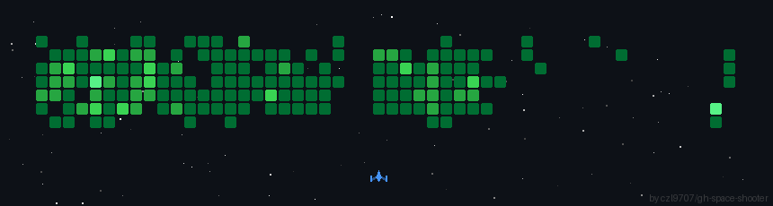

  <h2>Web Developer & Project Manager</h2>

<h4>I am a skilled Web Developer with strong experience in JavaScript/TypeScript and its frameworks, as well as expertise in PHP, WordPress, and related technologies. 
I have a solid background in building modern, user-friendly web applications and dynamic websites tailored to client needs.</h4>

<h4>My development experience covers both frontend and backend, including technologies such as React, Next.js, Angular.js, Vue.js, Svelte.js, Node.js, Nest.js, ASP.NET, Python and integrations with popular content management systems like WordPress, Shopify.
I am dedicated to delivering high-quality, maintainable, and scalable solutions for a wide range of web projects.</h4>

 

# 
<table align="center">

  <tr>
    <td align="center" width="90">
      
       Javascript
    </td>
    <td align="center" width="90">
      
       Typescript
    </td>
    <td align="center" width="90">
      
       React
    </td>
     <td align="center" width="90">
      
       Redux
    </td>
    <td align="center" width="90">
      
       SASS
    </td>
    <td align="center" width="90">
      
       C#
    </td>
    <td align="center" width="90">
      
       Python
    </td>
    <td align="center" width="90">
      
       PHP
    </td>
    <td align="center" width="90">
      
       Angular
    </td>
    <td align="center" width="90">
      
       Vue
    </td>
  </tr>

<tr>
  <td align="center" width="90">
    
     Next
  </td>
  <td align="center" width="90">
    
     Svelte
  </td>
  <td align="center" width="90">
    
     Node
  </td>
  <td align="center" width="90">
    
     Nest
  </td>
  <td align="center" width="90">
    
     PHP
  </td>
  <td align="center" width="90">
    
     Tailwind CSS
  </td>
  <td align="center" width="90">
    
     Bootstrap
  </td>
  <td align="center" width="90">
    
     Supabase
  </td>
  <td align="center" width="90">
    
     Firebase
  </td>
  <td align="center" width="90">
    
     WordPress
  </td>
</tr>
<tr align="center">
    <td align="center" width="90">
      
       MySQL
    </td>
    <td align="center" width="90">
      
       PostgreSQL
    </td>
    <td align="center" width="90">
      
       MongoDB
    </td>
  </tr>

  
</table>
 

     

     

